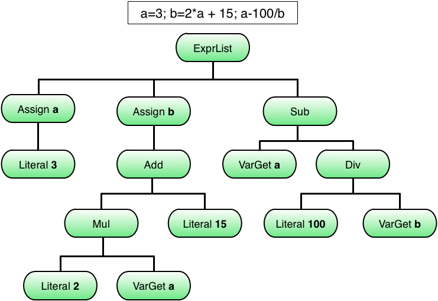

# What's an abstract syntax tree

Any language parser has to generate some kind of output that is uaefull for further processing. In case if PHP the output is a series of opcodes for the Zend-Engine, which is good for performance interpretation, but not very helpful for structured code-conversion. An abstract syntax tree (AST) is a more generic output of a parser. In theory any kind of expression or statement can be written down in form of a tree of singular operations.

Consider the following C- or Java-like example:

The nodes of this AST break down like this:

* The top-most `ExprList` serves as a simple container for an arbitrary number of expressions to be evaluated in sequence. In the the example the expressions are separated by `;`, though is of no relevance for the AST.
* `Assign` is a parameterized node in the AST: The result of the child expression should be assigned/stored to a variable defined by the parameter.
* `Add`, `Sub`, `Mul` and `Div` are the AST representation of all binary operators: Addition `+`, subtraction `-`, multiplication `*` and division `/`. All of these nodes require to have exactly two child nodes (left and right).
* `Literal` is a parameterized leaf (i.e. it must not have child node) in the AST representing a literal number.
* `VarGet` is another parameterized leaf, to retrieve the current value of a variable defined by the parameter.

# How to create an AST with combinators

Returning to the previous calculator example, one might define a simple AST structure like this


trait Node { }

trait Expr extends Node { }

case class ExprListExpr(exprs: List[Expr]) extends Expr

case class LiteralExpr(value: Int) extends Expr

case class AddExpr(left: Expr, right: Expr) extends Expr

case class SubExpr(left: Expr, right: Expr) extends Expr 

case class MulExpr(left: Expr, right: Expr) extends Expr

case class DivExpr(left: Expr, right: Expr) extends Expr 

case class VarGetExpr(name: String) extends Expr

case class AssignExpr(name: String, expr: Expr) extends Expr 


The parser for this now becomes a beauty of simplicity - at least once one can read the combinator syntax fluently.


object ASTParser extends StdTokenParsers {
  override type Tokens = StdLexical

  override val lexical = new StdLexical

  lexical.delimiters ++= List("(", ")", "+", "-", "*", "/", "=", ";")

  def exprs: Parser[Expr] = repsep(expr, ";") ^^ ExprListExpr

  def expr: Parser[Expr] = assign | addSub

  def assign: Parser[Expr] = ident ~ "=" ~ addSub ^^ { case name ~ _ ~ valueExpr => AssignExpr(name, valueExpr) }

  def addSub: Parser[Expr] = mulDiv * ("+" ^^^ AddExpr | "-" ^^^ SubExpr)

  def mulDiv: Parser[Expr] = term * ("*" ^^^ MulExpr | "/" ^^^ DivExpr)

  def term: Parser[Expr] = 
    "(" ~> expr <~ ")" | "-" ~> expr ^^ NegExpr | ident ^^ VarGetExpr | numericLit ^^ (str => LiteralExpr(str.toInt))
...
}


It should be pointed out, that tools like AntLR are able to generate all this - including the AST itself - from an even simpler grammar file. The drawback is that generated code is usually leas flexible.

# How abstract syntax trees facilitate interpretation

Once one has an AST, interpretation becomes straight forward. First one needs some form of execution context, in this case just a place where to store and retrieve arbitrary variables:


class CalculatorContext {
  private val variables = mutable.Map.empty[String, Int]

  def getVariable(name: String): Option[Int] = variables.get(name)

  def setVariable(name: String, value: Int) = variables.put(name, value)
}


Next one just has to add an evaluation method to the `Expr` nodes to produce a result for a given context


trait Expr extends Node {
  def eval(implicit context: CalculatorContext): Int
}


... and implement it for there concrete nodes, which might be a one-liner in most cases


case class AddExpr(left: Expr, right: Expr) extends Expr {
  override def eval(implicit context: CalculatorContext) = left.eval + right.eval
}

case class SubExpr(left: Expr, right: Expr) extends Expr {
  override def eval(implicit context: CalculatorContext) = left.eval - right.eval
}

case class VarGetExpr(name: String) extends Expr {
  override def eval(implicit context: CalculatorContext) = context.getVariable(name).getOrElse {
    throw new RuntimeException(s"Variable $name not defined")
  }
}

case class AssignExpr(name: String, expr: Expr) extends Expr {
  override def eval(implicit context: CalculatorContext) = {

    val value = expr.eval
    context.setVariable(name, value)
    value
  }
}
...


Form here one it become just a matter of time and dedication to extend this simple calculator example to a full fledged language interpreter.

# The problems with the PHP grammar

It might seem that creating an AST for PHP is straight forward as well. While this is true for some parts, there are some quirks that need to be addressed

* First of all the example above works so nicely, because the structure of the parser and the AST are a perfect match for each other. While it is certainly possible to generate a generic AST from the original bison grammar of PHP, this would not be very "nice" for interpretation or conversion. There are several examples of parser rules that have to be combined to a single AST node, while some rules should produce several nodes.
* Some runtime aspects of PHP do not fit well to the classic interpreter approach demonstrated in this example, e.g.


<?php
$a = 10;
echo "First: $a\n";

static $a = 20;
echo "Second: $a\n";

if ( $a < 35 ) {
    static $a = 30;
    echo "Third: $a\n";
} else {
    static $a = 40; 
    echo "Fourth: $a\n";
}
?>


will produce

~~~
First: 10
Second: 40
Fourth: 40
~~~

I.e. static assignments work somewhat differently than "normal" assignments.
