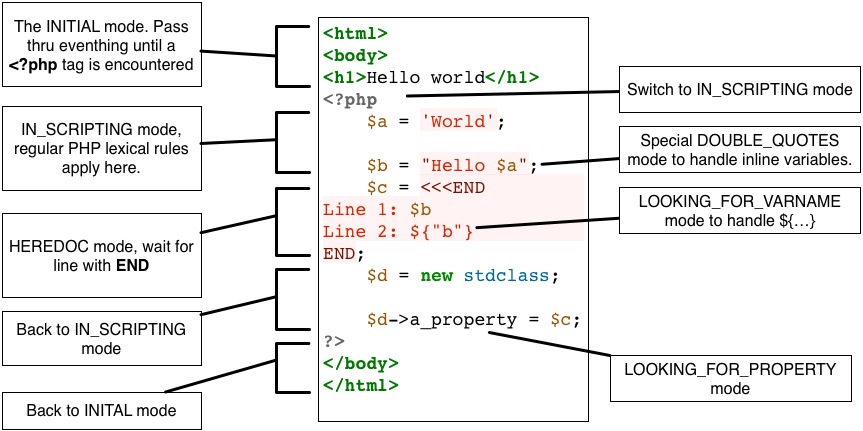

As discussed in the previous section the scala combinator framework is quite powerful and already offers a generic support for lexical anaylzers. Unluckily this does not suffice for PHP, since there is no support for lexer modes.

# What's a lexer mode

In classical lexer generators modes are a feature to tag rules, i.e. to turn on and off certain rules depending on the mode the lexer currently operates in. Usually lexer modes can be used in form of a stack, i.e. you might push a new mode to the stack and eventually pop back to the original mode.

An often used example of lexer modes are comments: If the lexer encounters a `/*` it switches to an "in comment" mode where everything is ignored and pop back to its previous mode once an `*/` is encountered.

# The many lexer modes of PHP

Since lexer modes are basically just selectors for rules, it is always possible to rewrite any lexer to operate in a single mode. After all scala's `StdLexer` is perfectly capable of handling `/* ... */` style comments without relying on lexer modes. The drawback to this, that the removal the lexer modes may lead to a vast duplication of rules and a closer look at the original PHP lexer reveals that it has 10 modes in total:

* INITIAL
* IN_SCRIPTING
* DOUBLE_QUOTES
* BACKQUOTE
* HEREDOC
* END_HEREDOC
* NOWDOC
* VAR_OFFSET
* LOOKING_FOR_PROPERTY
* LOOKING_FOR_VARNAME

Most of these are demonstrated in this simple example:

Combining all there to a single rule set might be possible, but wont be pretty.

# Lexer modes with scala combinators

The extension of the `StdTokenParsers` to a lexical analyzer with lexer mode support is pretty straight forward. First we define some very simple traits.


trait LexerMode {
  def newLexer(): Lexer
}

trait Lexer extends Parsers {
  type Elem = Char

  def token: Parser[(Token, Option[LexerMode])]

  val whitespace: Parser[Any] = success(Unit)
}


The idea is that a `LexerMode` serves as factory for a `Lexer`, whereas a `Lexer` defines a `token` parser and a `whitespace` parser. All input consumed by the `whitespace` parse is supposed to be ignored, by default the `whitespace` parser yields an immediate success without consuming anything. The `token` parser is the actual lexical analyzer the produces a `Token` and an optional `LexerMode` if a mode-switch is necessary.

The main magic happens in the implementation of the `Reader[Token]`, that is used as input for the syntactical parser. At its core the implementation looks like this:


class TokenReader(in: Reader[Char], lexer: Lexer) extends Reader[Token] {

  import lexer.{Success, NoSuccess, token, whitespace}

  def this(in: String, lexer: Lexer) = this(new CharArrayReader(in.toCharArray), lexer)

  private val (tok: Token, mode: Option[LexerMode], rest1: Reader[Char], rest2: Reader[Char]) = whitespace(in) match {
    case Success(_, in1) =>
      token(in1) match {
        case Success((token, m), in2) => (token, m, in1, in2)
        case ns: NoSuccess => (errorToken(ns.msg), None, ns.next, skip(ns.next))
      }
    case ns: NoSuccess => (errorToken(ns.msg), None, ns.next, skip(ns.next))
  }

  def first = tok

  def rest = new TokenReader(rest2, mode.map(_.newLexer()).getOrElse(lexer))

  ...
}

