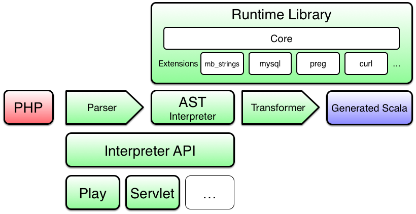

* Runtime library
  * Encapsulate a compatible PHP runtime environment
  * Basic type system and arithmetics
  * Registry for PHP function, classes and variables
  * Extension/module system
* Necessary extensions/modules that are used in most PHP projects
  * mb_strings
    * Multi-byte string
    * This is the actual unicode support for PHP
  * mysql
    * Most commonly used database access in PHP
  * preg
    * Support for regular expressions in PHP
  * bcmath
    * Arbitrary-precision integers and decimals
  * curl
    * Most commonly used HTTP library
  * ...
* Abstract syntax tree (AST)
  * Also contains interpreter code using the runtime library
* Parser
  * Convert PHP code to the AST
* API
  * To quickly integrate PHP into a Java-based web-container of your choice
  * Examples for Play
  * Maybe examples for Servlet API as well
* Transformer
  * Convert an AST to Scala code
  * Do some basic syntax analysis to reduce the amount of unnecessary code

